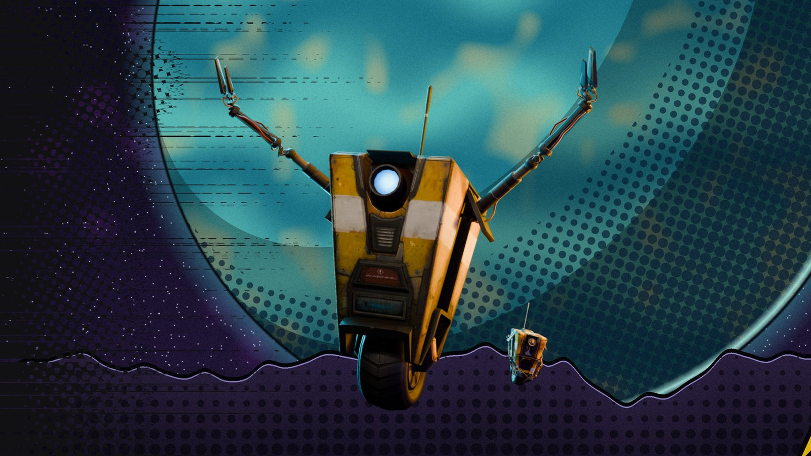
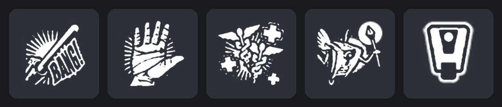
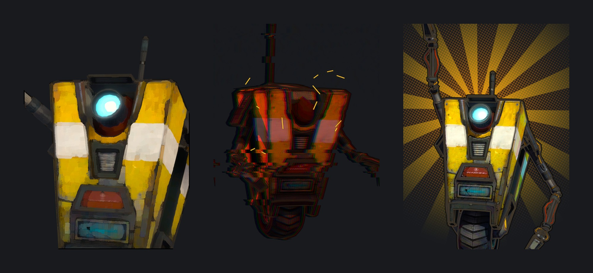

# Claptrap-Rem

Claptrap from Borderlands, replacing Rem in [Deadlock](https://store.steampowered.com/app/1422450/Deadlock/).



## Features

- New model and animations, built for a robot on a wheel
- The Globber pistol from *The Pre-Sequel*, with its own sounds
- Abilities reskinned as Fragtrap's VaultHunter.EXE modes, with icons from *The Pre-Sequel*
- Glowing eye
- Over 1,400 Claptrap voice lines
- Mini-Claptraps in place of Rem's helpers
- Custom hero-select scene, hero cards and portraits

### Abilities

| Rem ability | Claptrap theme |
|---|---|
| Pillow Toss | Clap-in-the-Box |
| Tag Along | HIGH FIVES GUYS |
| Lil Helpers | Miniontrap |
| Naptime | Captivating Monologue |





## Install

1. Download `pak03_dir.vpk` from the [latest release](../../releases/latest).
2. Open `Deadlock\game\citadel\gameinfo.gi` and add this line inside `SearchPaths`, above `Game citadel`:
   ```
   Game                citadel/addons
   ```
3. Put the VPK in `Deadlock\game\citadel\addons\`. Create the folder if it doesn't exist.
4. Launch the game and pick Rem.

Game updates can reset `gameinfo.gi`. If the mod stops loading, add the line again.

## Known issues

- Some of Rem's effects keep their original teal colour.
- A few hero-specific voice callouts still use Rem's voice.

## Credits

Claptrap and all Borderlands assets belong to Gearbox Software and 2K. Deadlock belongs to Valve. This is a free fan mod and isn't affiliated with either.

Hero-select presentation inspired by the [Adam Smasher Bebop](https://gamebanana.com/mods/698296) mod.
